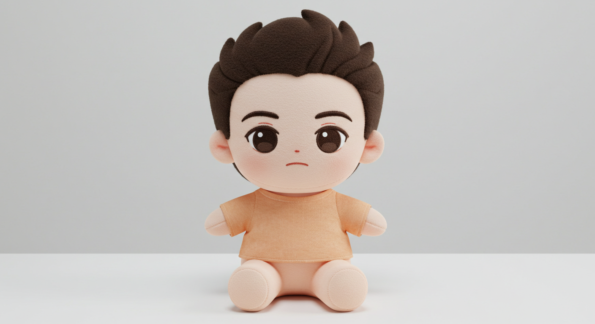
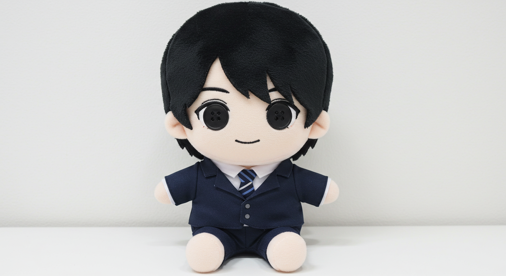
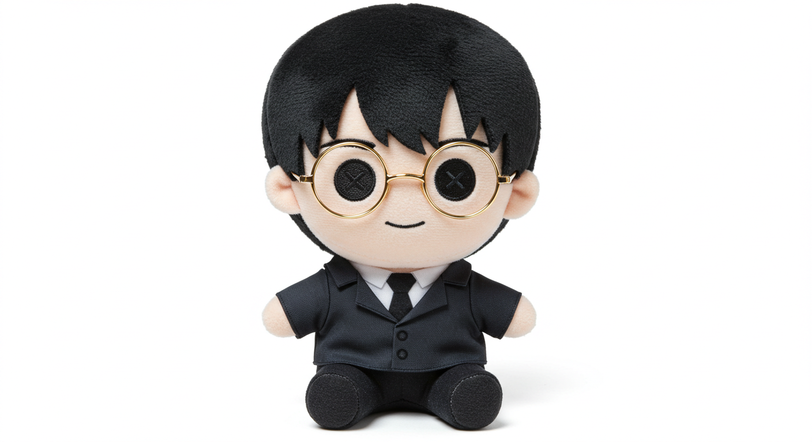
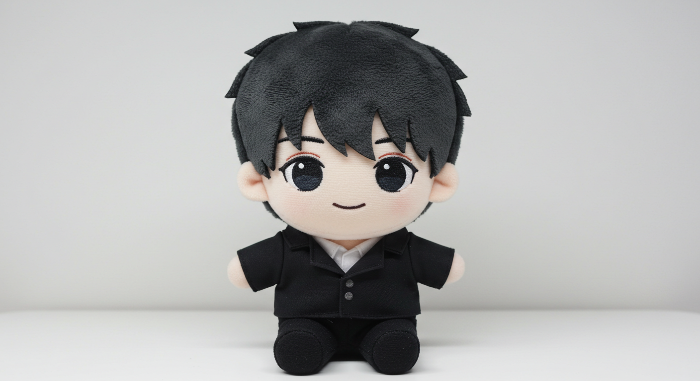
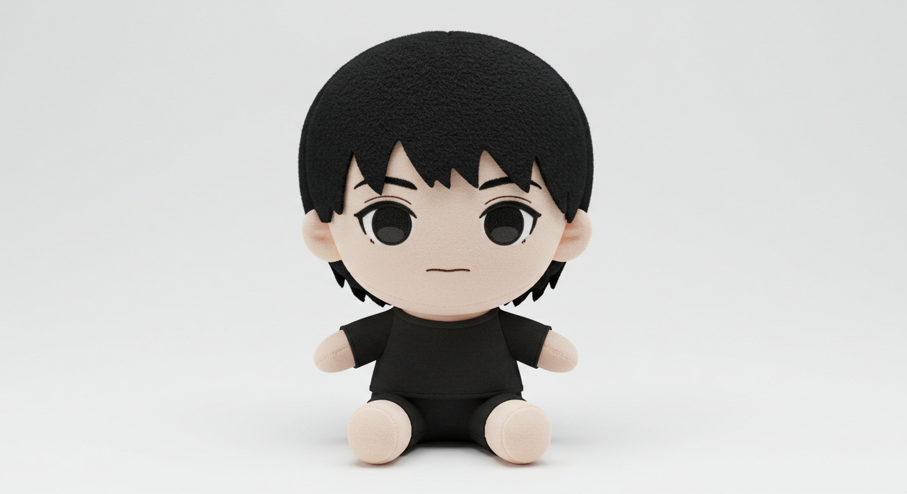
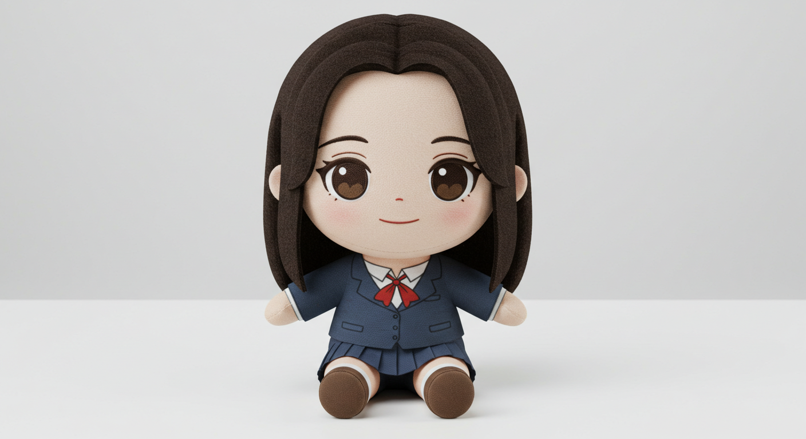

# [AIOI] 드러와잉(DrawAIng)

# 프로젝트 소개

AI의 인식을 피해 사람만 이해할 수 있는 그림을 그려 정답을 맞추는 협력 파티 게임

## 주요 기능

**1. AI 게임 시스템**  

플레이어 세 명이 그림을 이어그리고 한 플레이어와 AI가 맞추는 방식의 캐치마인드 게임 진행  

    1. 3명이서 이어 그리기
    2. 한 붓 그리기+이어 그리기
    3. 나머지 한 명이 AI보다 빠르게 답 맞추기
    4. 총 제한 시간 10분
    5. AI와 플레이어가 맞춘 제시어 수에 따라 승패 결정
    6. 그림 판별하는 AI 모델 직접 개발
    7. 추후 개선점
      7-1. 플레이어 그림 데이터 수집 파이프라인 구축 및 이를 통한 추가 학습

**2. 매칭 시스템**  

    1. 방 만들기 시스템
      1-1. 방 코드 생성 후 공유
      1-2. 방 찾기로 코드 입력 후 참여
    2. 추후 개선점
      2-1. 방 목록
      2-2. 방 검색
      2-3. 비밀번호 방
      2-4. 친구 초대 시스템

## 세부 기능

**1. 경험치(레벨) 시스템**

    1. 레벨별 필요 경험치 테이블에 맞춰 레벨업하는 시스템

**2. 로그인/회원가입 시스템**

    1. 보안을 위해 JWT 토큰 사용
    2. 플레이어 접근성을 위해 게스트 로그인 구현
    3. 로컬 로그인 뿐만 아니라 다양한 소셜 로그인 제공

**3. 랭킹 시스템**  

    1. 게임에서 최종적으로 승리하게 되면 포인트 획득
    2. 포인트는 맞춘 문제 수 만큼(맞춘 문제를 그린 사람도 맞춘걸로 침) 차등하게 나눠줌
    3. 랭킹 점수, 포인트, 레벨, 플레이 횟수 랭킹 구분
    4. 추후 개선점
      4-1. 명예의 전당

**4. 상점 시스템**

    1. 캐릭터, 이모티콘 등 아이템 구매 기능
      1-1. 한정 수량, 레벨 제한
      1-2. 캐릭터 이미지는 생성형 AI 활용하여 제작
    2. 플레이어 인벤토리 기능
      2-1. 아이템 사용 기능 (캐릭터 변경)

## 기술적 고민과 해결 과정

### 백엔드

**1. MSA**

**2. 인증/인가 (MSA 구조에 따른 인증/인가 구조 변경)**

**3. 웹소켓**

**4. Redis + Kafka를 사용한 상점 서비스 선착순 아이템 대용량 트래픽 해결**

## 프론트엔드 

**1. 웹소켓**

## AI 

**1. 정확도 증대**

MobileNet, ShuffleNet, Mnasnet, VGC19, Resnet50 등의 모델을 전이학습시켜서 정확도가 가장 높은 모델을 선정.
자체 제작으로 Residual block, Depthwise Separable Convolution 기법을 통해 일반적인 분류 모델보다 Loss값을 줄이고자 했음.

**2. 분류 처리 속도**

양자화, Pruning 기법 등을 시도해봤으나 정확도를 크게 깎는 문제가 있어서 결국 전이학습과 병행하여 처리했음

## 기술 스택

### 프론트엔드

  
  
  
  

### 백엔드

   
   
   
  
  
   
   
   

### 인프라 

  
  
   
  
  
    
  
   
   

### 협업 

  
  

## 소프트웨어 아키텍처

# 팀원 소개

| Profile | Name | Role | GitHub | Main Tasks |
|:---:|:---:|:---:|:---:|:----|
||김예훈|AI|[@yehoon-already-have](https://github.com/yehoon-already-have)| AI 모델 설계, fastAPI 서버 구현 및 연결 |
||문상혁|FE|[@Moon-sang-hyeok](https://github.com/Moon-sang-hyeok)|웹소켓을 활용한 실시간 대기방 입장, 퇴장, 레디 상태 동기화 테일윈드를 활용한 페이지 구현|
||노진원|FE|[@nororong](https://github.com/Nororong)|웹소켓을 활용한 실시간 게임 시스템 동기화, 테일윈드를 활용하여 페이지 CSS 구현|
||차정문|BE|[@beegle98](https://github.com/beegle98)| 인증/인가(JWT, Spring Security), 웹소켓 방만들기/채팅 API, (랭킹, 상점, 로그인/회원가입) 서비스 개발, (랭킹,상점,인벤토리) 페이지 구현|
||오세학|INFRA|[@sehako](https://github.com/sehako)|마이크로 서비스 아키텍처 구축 및 도커 컴포즈를 활용한 배포 및 CI/CD 환경 구축, AI API 서버 배포|
||김률아|BE|[@ryulkim](https://github.com/ryulkim)|WebSocket, STOMP 기술을 사용한 게임 API 기능(방 되돌아가기, 대기방에서 참여자 정보 전달, 타이머 기능, 정답 맞추기 등)
Rest API(링크 초대, 방 생성)|

(다음 사이트에서 사진 제작: [whisk](https://labs.google/fx/ko/tools/whisk))

# 주요 기능

- 실시간 협동 그리기: 4명의 플레이어가 순서대로 그림을 이어서 그립니다.

- 웹소켓 기반 실시간 동기화: 그림, 타이머, 정답 입력, 제시어 등 모든 게임 요소가 실시간으로 동기화됩니다.
    - 그리기 이벤트 (선, 색상, 지우기 등)
    - 타이머
    - 플레이어 차례
    - 채팅 및 정답 입력
    - 게임 상태 변경

- AI와 대결: 플레이어들은 AI보다 먼저 정답을 맞추어야 합니다.

  점수 시스템: 정답 맞추기 성공 여부와 속도에 따라 점수가 부여됩니다.

- 다양한 로그인 방식: 일반 로그인, 소셜 로그인(구글, 네이버, 카카오) 및 게스트 로그인 지원

## 페이지 구성 

###  메인 페이지

게임 소개, 로그인 및 회원가입, 게임 시작 버튼이 있는 랜딩 페이지   

**로그인**

**게스트 로그인**

**게임 대기방 페이지**

다른 플레이어를 기다리는 화면으로 사용자 입장 시 데이터를 플레이어칸에 로드되도록 구현

### 게임 페이지

실제 게임 진행이 이루어지는 핵심 페이지 

(그림판, 채팅, 타이머, 정답입력 포함)

**그림을 그리는 경우**

그린 이미지가 실시간으로 웹소켓으로 전달되어 브로드캐스팅

**채팅을 하는 경우**

**정답을 맞추는 경우**

정답을 맞춘 플레이어 또는 AI의 점수를 1점 더하고 다음 라운드로 넘어가기 됨

**게임 종료**

웹소켓으로 게임 종료 타이밍을 동기화한 뒤 모달 표시

### 게임 결과 페이지

게임 종료 후 결과 및 통계 출력

### 상점 페이지

게임 내 포인트로 아이템을 구매할 수 있는 페이지

게임을 통해 얻는 재화(계란)을 통해 다양한 아이템 구매 가능

### 인벤토리 페이지

내가 가진 아이템 조회 페이지

아이템 사용 기능 (캐릭터 변경)

### 랭킹 페이지

랭킹 점수, 포인트, 레벨, 플레이 횟수 별 랭킹 제공 페이지

각 분야별 1,2,3등 표시 및 로그인한 플레이어의 랭킹 표시

