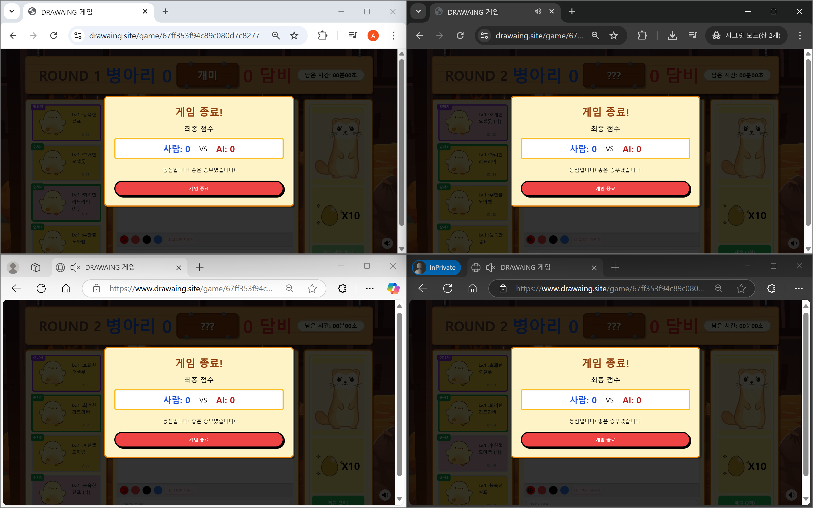

# [AIOI] 드러와잉(DrawAIng)
# 프로젝트 소개
AI의 인식을 피해 사람만 이해할 수 있는 그림을 그려 정답을 맞추는 협력 파티 게임

## 주요 기능

**1. AI 게임 시스템**  
유저 세 명이 그림을 이어그리고 한 유저와 AI가 맞추는 방식의 캐치마인드 게임 진행  

    1. 3명이서 이어 그리기
    2. 한 붓 그리기+이어 그리기
    3. 나머지 한 명이 AI보다 빠르게 답 맞추기
    4. 총 제한 시간 10분
    5. AI와 유저가 맞춘 제시어 수에 따라 승패 결정
    6. 그림 판별하는 AI 모델 직접 개발
    7. 추후 개선점
      7-1. 유저 데이터 수집 파이프라인 구축
      7-2. 유저 데이터 추가 학습

**2. 매칭 시스템**  

    1. 방 만들기 시스템
      1-1. 방 코드 생성 후 공유
      1-2. 방 찾기로 코드 입력 후 참여
    2. 추후 개선점
      2-1. 방 목록
      2-2. 방 검색
      2-3. 비밀번호 방
      2-4. 친구 초대 시스템

## 세부 기능

**1. 경험치(레벨) 시스템**

    1. 레벨별 필요 경험치 테이블에 맞춰 레벨업하는 시스템

**2. 로그인/회원가입 시스템**

    1. 보안을 위해 JWT 토큰 사용
    2. 유저 접근성을 위해 게스트 로그인 구현
    3. 로컬 로그인 뿐만 아니라 다양한 소셜 로그인 제공

**3. 랭킹 시스템**  

    1. 게임에서 최종적으로 승리하게 되면 포인트 획득
    2. 포인트는 맞춘 문제 수 만큼(맞춘 문제를 그린 사람도 맞춘걸로 침) 차등하게 나눠줌
    3. 랭킹 점수, 포인트, 레벨, 플레이 횟수 랭킹 구분
    4. 추후 개선점
      4-1. 명예의 전당

**4. 상점 시스템**

    1. 캐릭터, 이모티콘 등 아이템 구매 기능
      1-1. 한정 수량, 레벨 제한
      1-2. 캐릭터 이미지는 생성형 AI 활용하여 제작
    2. 유저 인벤토리 기능
      2-1. 아이템 사용 기능 (캐릭터 변경)

## BACK_END 기술적 고민과 해결 과정

**1. MSA**
**2. 인증/인가 (MSA 구조에 따른 인증/인가 구조 변경)**
**3. 웹소켓**
**4. Redis + Kafka를 사용한 상점 서비스 선착순 아이템 대용량 트래픽 해결**

## FRONT_END 기술적 고민과 해결 과정
**1. 웹소켓**

## 아키텍처 설계

# 팀원 소개
| Profile | Name | Role | GitHub | Main Tasks |
|:---:|:---:|:---:|:---:|:----|
||김예훈|AI| | |
||문상혁|FE| | |
||노진원|FE| | |
||차정문|BE|[@beegle98](https://github.com/beegle98)| 인증/인가(JWT, Spring Security), 웹소켓 방만들기/채팅 API, (랭킹, 상점, 로그인/회원가입) 서비스 개발, (랭킹,상점,인벤토리) 페이지 구현|
||오세학|INFRA| | |
||김률아|BE|[@ryulkim](https://github.com/ryulkim)| |

# FrontEnd - 노진원, 문상혁

## 주요 기능
- 실시간 협동 그리기: 4명의 플레이어가 순서대로 그림을 이어서 그립니다.
- 웹소켓 기반 실시간 동기화: 그림, 타이머, 정답 입력, 제시어 등 모든 게임 요소가 실시간으로 동기화됩니다.
    - 그리기 이벤트 (선, 색상, 지우기 등)
    - 타이머
    - 플레이어 차례
    - 채팅 및 정답 입력
    - 게임 상태 변경
- AI와 대결: 플레이어들은 AI보다 먼저 정답을 맞추어야 합니다.
점수 시스템: 정답 맞추기 성공 여부와 속도에 따라 점수가 부여됩니다.
- 다양한 로그인 방식: 일반 로그인, 소셜 로그인(구글, 네이버, 카카오) 및 게스트 로그인 지원

## 페이지 구성 
- 메인 페이지
  - 게임 소개, 로그인 및 회원가입, 게임 시작 버튼이 있는 랜딩 페이지   
  
    - 게스트 로그인
      
    - 유저 로그인
      
- 게임 대기방 페이지
  - 다른 플레이어를 기다리며 게임 설정을 조정할 수 있는 페이지
    - 웹소켓을 통해 유저가 입장하면 데이터를 플레이어칸에 로드되도록 구현
    - ready
    
- 게임 페이지
  - 실제 게임 진행이 이루어지는 핵심 페이지 (그림판, 채팅, 타이머, 정답입력 포함)
  
  - 그림을 그리는 경우
    - 그린 이미지가 실시간으로 웹소켓으로 전달되어 브로드캐스팅
    
    - 채팅을 하는 경우
    
    - 정답을 맞추는 경우
    - 게임 종료시
      - 웹소켓으로 게임 종료 타이밍을 동기화한 뒤 모달 표시
      
- 게임 결과 페이지
  - 게임 종료 후 결과 및 통계를 보여주는 페이지
    
- 상점 페이지
  - 게임 내 포인트로 아이템을 구매할 수 있는 페이지
  - 게임을 통해 얻는 재화(계란)을 통해 다양한 아이템 구매 가능
    
- 인벤토리 페이지
  - 내가 가진 아이템 조회 페이지
  - 아이템 사용 기능 (캐릭터 변경)
    
- 랭킹 페이지
  - 랭킹 점수, 포인트, 레벨, 플레이 횟수 별 랭킹 제공 페이지
  - 각 분야별 1,2,3등 표시
  - 내 랭킹 표시
    

## 팀 회고
